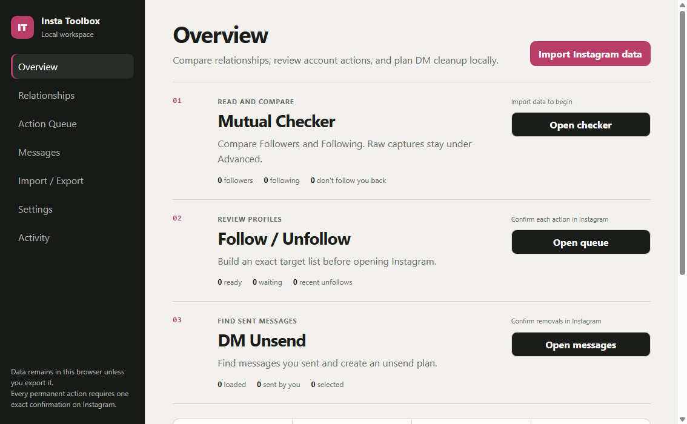

# Insta Toolbox

**[Install the Tampermonkey userscript](https://github.com/slaveofsolace/Insta-Toolbox/releases/latest/download/insta-toolbox.user.js)**



Instagram utilities that run locally in your browser. Check mutuals, review follow or unfollow targets, and unsend your own messages from the conversation you have open.

## Install in one or two minutes

1. Install [Tampermonkey](https://www.tampermonkey.net/) for your browser.
2. In Chrome, open `chrome://extensions`, select **Details** for Tampermonkey, and enable **Allow User Scripts**. Skip this step if your browser does not show it.
3. Open the **Install the Tampermonkey userscript** link above.
4. Choose **Install** in Tampermonkey.
5. Open or reload [instagram.com](https://www.instagram.com/). Press `Alt+Shift+I` if the panel is hidden.

Version 3.0 uses a new userscript identity. Remove any 2.x userscript before
installing 3.0 so only one panel loads. Version 3.0 starts clean and leaves 2.x
browser or desktop data untouched.

See [Installation](docs/INSTALLATION.md) for the extension, desktop apps, web app, checksums, updates, and uninstall steps.

## What it does

- **Mutual Checker** compares Followers and Following without changing the account.
- **Follow / Unfollow** builds a finite target list, previews every target, and asks for confirmation before clicking.
- **DM Unsend** works in the open conversation, confirms the thread and action, and reports only verified removals.
- **Workspace** keeps local imports, comparisons, reviewed plans, ledgers, and exports in the PWA or desktop app.

Live actions start disabled on every load. A follow, unfollow, or unsend run requires an action-specific confirmation. Stop remains available during a run. Challenge, rate-limit, wrong-thread, ambiguous-control, and uncertain-result checks stop the runner.

## Other ways to run it

Download files from the [latest release](https://github.com/slaveofsolace/Insta-Toolbox/releases/latest).

| Surface | Release file | Use it when |
| --- | --- | --- |
| Tampermonkey | `insta-toolbox.user.js` | You want the simplest Instagram overlay install. |
| Chrome extension | `Insta-Toolbox-Extension-3.0.0.zip` | You prefer an unpacked browser extension. |
| Windows desktop | `Insta-Toolbox-Setup-3.0.0.exe` | You want one downloadable Windows installer. |
| macOS desktop | `Insta-Toolbox-3.0.0-universal.dmg` | You want the recommended drag-to-Applications package for Intel or Apple Silicon. |
| macOS portable | `Insta-Toolbox-3.0.0-universal.zip` | You prefer to extract the universal app directly. |
| Web/PWA | `insta-toolbox-web-3.0.0.zip` | You want to self-host the local-first workspace. |

Windows packages are unsigned. macOS packages are ad-hoc signed, but not Developer ID signed or notarized. Confirm the checksum before opening a download.

### Check a download

Download `SHA256SUMS.txt` from the same release.

Windows PowerShell:

```powershell
Get-FileHash .\Insta-Toolbox-Setup-3.0.0.exe -Algorithm SHA256
```

macOS:

```sh
shasum -a 256 Insta-Toolbox-3.0.0-universal.dmg
```

Match the printed hash to the file's entry in `SHA256SUMS.txt`.

## Data and permissions

Insta Toolbox is local-first. It does not ask for an Instagram password, read cookies directly, send analytics, or use a remote control service. The overlay uses the Instagram session already active in the tab. Required host access is limited to Instagram. Pairing requests optional access only to the exact workspace origin you approve.

Local workspace data may include account labels, captured lists, plans, message records, and action ledgers. Export or delete it from the app when you choose. Do not publish exports that contain private account data.

Read [Security](SECURITY.md) for supported versions and private vulnerability reporting. The detailed boundary review is in [Security Review](docs/SECURITY_REVIEW.md).

## Remove it

- **Tampermonkey:** open the Tampermonkey dashboard and delete **Insta Toolbox**.
- **Chrome extension:** open `chrome://extensions` and remove **Insta Toolbox**.
- **Windows:** uninstall **Insta Toolbox** from **Installed apps**.
- **macOS:** quit the app and move **Insta Toolbox** from Applications to Trash.
- **PWA:** uninstall it from the browser's app menu. Clear the site's storage if you also want to erase local workspace data.

## Develop locally

Requirements: Git and Node.js 24.

```sh
corepack enable
pnpm install --frozen-lockfile
pnpm run assemble
pnpm test
```

Useful checks:

```sh
pnpm run qa:extension
pnpm run qa:chrome
pnpm run qa:browser:check
pnpm run qa:overlay:check
pnpm run verify:repo-hygiene
```

The 3.0 account-free regression matrix contains 347 tests, 45 overlay states, and 11 PWA states. The service worker uses cache generation `insta-toolbox-v300`. Authenticated Instagram behavior still depends on the current site and must be accepted separately with disposable content.

See [Contributing](CONTRIBUTING.md), [Maintainer Guide](docs/MAINTAINER_GUIDE.md), [3.0 compatibility](docs/compatibility/3.0.0.md), and [3.0 acceptance](docs/acceptance/3.0.0.md).

## License and credit

MIT licensed. Copyright (c) 2026 [slaveofsolace](https://github.com/slaveofsolace).

Redistributed original or modified copies must keep the copyright and MIT license notice. Third-party notices are in [THIRD_PARTY_NOTICES.md](THIRD_PARTY_NOTICES.md).
