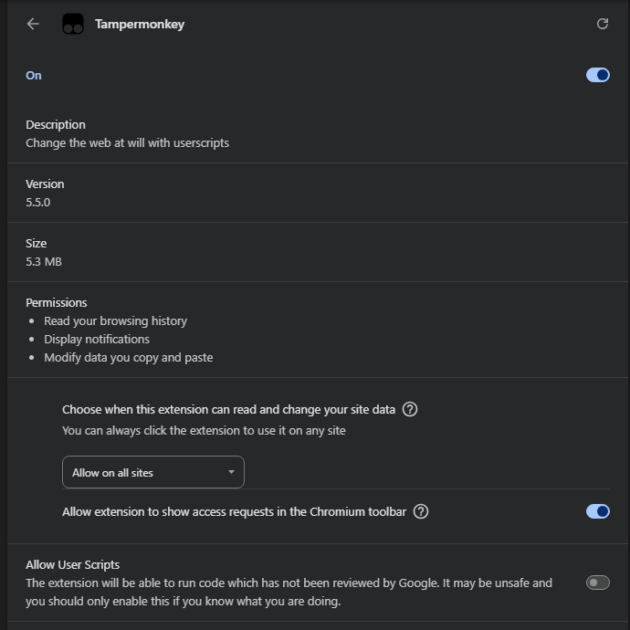
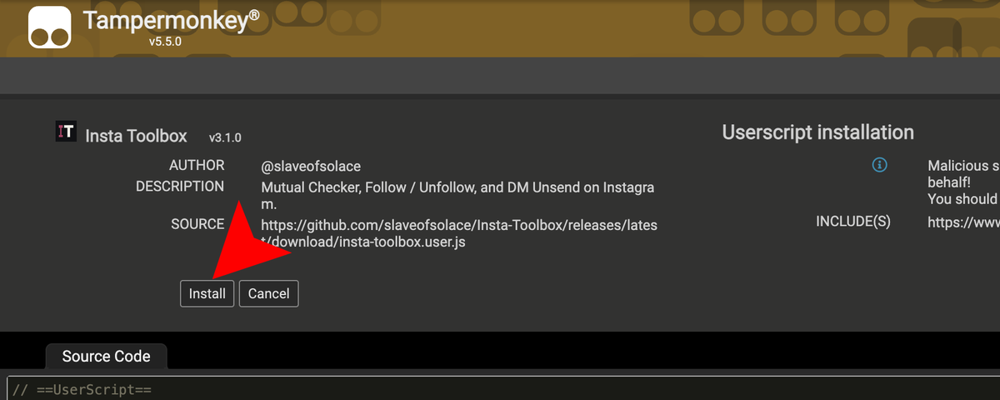
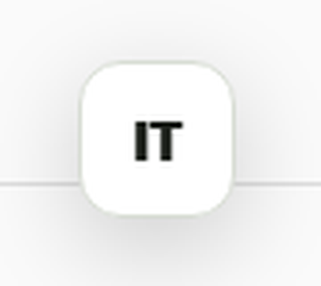
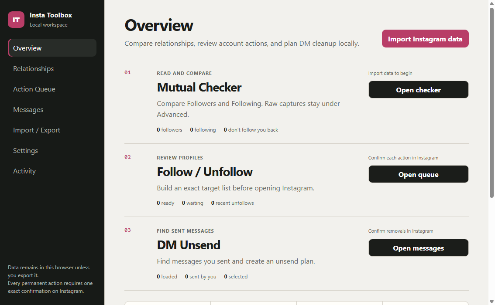

# Insta Toolbox

**[Install Insta Toolbox with Tampermonkey](https://github.com/slaveofsolace/Insta-Toolbox/releases/latest/download/insta-toolbox.user.js)**

Instagram utilities that run locally in your browser. Check mutuals, review follow or unfollow targets, and unsend your own messages from the conversation you have open.
## Install in about a minute

1. Install [Tampermonkey](https://www.tampermonkey.net/).

2. In Chrome, open `chrome://extensions/?id=dhdgffkkebhmkfjojejmpbldmpobfkfo`. Turn on **Allow User Scripts**.

   

3. Click **[Install Insta Toolbox](https://github.com/slaveofsolace/Insta-Toolbox/releases/latest/download/insta-toolbox.user.js)**, then click the **Install** button on the left below the script details.

   

4. Open or reload [Instagram](https://www.instagram.com/). Click **IT**. If it is hidden, press `Alt+Shift+I`.

   

## You're done — enjoy! :)

Need help or found a bug? [Submit a ticket](https://slaveofsolace.com/work/contact/) or [open an issue](https://github.com/slaveofsolace/Insta-Toolbox/issues).

### Like my work?

[](https://www.buymeacoffee.com/slaveofsolace)

Already on version 3.x or 4.x? Tampermonkey updates it in place. Remove any 2.x copy so only one panel loads.

See [Installation](docs/INSTALLATION.md) for the extension, desktop apps, web app, checksums, updates, and uninstall steps.



## What it does

- **Mutual Checker** compares the accounts Instagram returns. Browse, search, or download the results even when a list is partial. Partial results use “Not found” labels: a missing account may still be a mutual. [Why lists can be partial](docs/MUTUAL_CHECKER_PARTIAL_RESULTS.md).
- **Presence** can view stories, react to stories, like posts, follow people, and accept incoming requests through Instagram's visible controls. Live sessions keep going for the chosen duration with normal action spacing; scheduled breaks are optional. Pause, Stop, and a private activity log stay available.
- **DM Unsend** removes your messages from the open conversation. **Start Ghost Mode** finds available conversations, asks for one confirmation, then cleans up ten conversations at a time. Each group of tabs finishes and closes before the next ten open. Keep the inbox tab open; Unsend clicks share the account pacing. Selected cleanups can use smaller batches.
- **Profile and content insights**, inside Mutual Checker, summarize loaded posts, linked hashtags and media types, with text and JSON downloads. Results describe the loaded sample, not a complete account history.
- **Workspace** keeps local imports, comparisons, reviewed plans, ledgers, and exports in the PWA or desktop app.

Live actions start disabled on every load. A follow, unfollow, or unsend run requires an action-specific confirmation. Stop remains available during a run. Challenge, rate-limit, wrong-thread, ambiguous-control, and uncertain-result checks stop the runner.

Mutual Checker waits before retrying rate-limited reads: Instagram's reset time when supplied, otherwise five minutes then ten. A countdown shows the wait; Stop cancels it. [Cooldown details](docs/MUTUAL_CHECKER_COOLDOWNS.md).

## Other ways to run it

**Tampermonkey is the active update channel.** All other packages are **On hold after 4.3.1**. Their existing code, data and downloads remain available; future feature work focuses on the userscript.

The Tampermonkey link always serves the latest published release. Other downloads stay pinned to [4.3.1](https://github.com/slaveofsolace/Insta-Toolbox/releases/tag/v4.3.1).

| Surface | Status | Release file |
| --- | --- | --- |
| Tampermonkey | Active | [Install userscript](https://github.com/slaveofsolace/Insta-Toolbox/releases/latest/download/insta-toolbox.user.js) |
| Chrome extension | On hold after 4.3.1 | [Download ZIP](https://github.com/slaveofsolace/Insta-Toolbox/releases/download/v4.3.1/Insta-Toolbox-Extension-4.3.1.zip) |
| Windows desktop | On hold after 4.3.1 | [Download installer](https://github.com/slaveofsolace/Insta-Toolbox/releases/download/v4.3.1/Insta-Toolbox-Setup-4.3.1.exe) |
| macOS desktop | On hold after 4.3.1 | [Download DMG](https://github.com/slaveofsolace/Insta-Toolbox/releases/download/v4.3.1/Insta-Toolbox-4.3.1-universal.dmg) |
| macOS portable | On hold after 4.3.1 | [Download ZIP](https://github.com/slaveofsolace/Insta-Toolbox/releases/download/v4.3.1/Insta-Toolbox-4.3.1-universal.zip) |
| Web/PWA | On hold after 4.3.1 | [Download web package](https://github.com/slaveofsolace/Insta-Toolbox/releases/download/v4.3.1/insta-toolbox-web-4.3.1.zip) |

Windows packages are unsigned. macOS packages are ad-hoc signed, but not Developer ID signed or notarized. Confirm the checksum before opening a download.

### Check a download

Download [SHA256SUMS.txt for 4.3.1](https://github.com/slaveofsolace/Insta-Toolbox/releases/download/v4.3.1/SHA256SUMS.txt) for the held packages. For the latest userscript, use checksums from its release.

Windows PowerShell:

```powershell
Get-FileHash .\Insta-Toolbox-Setup-4.3.1.exe -Algorithm SHA256
```

macOS:

```sh
shasum -a 256 Insta-Toolbox-4.3.1-universal.dmg
```

Match the printed hash to the file's entry in `SHA256SUMS.txt`.

## Data and permissions

Insta Toolbox is local-first. It does not ask for an Instagram password, read cookies directly, send analytics, or use a remote control service. The overlay uses the Instagram session already active in the tab. Required host access is limited to Instagram. Pairing requests optional access only to the exact workspace origin you approve.

Local workspace data may include account labels, captured lists, plans, message records, and action ledgers. Export or delete it from the app when you choose. Do not publish exports that contain private account data.

Read [Security](SECURITY.md) for supported versions and private vulnerability reporting. The detailed boundary review is in [Security Review](docs/SECURITY_REVIEW.md).

## Remove it

- **Tampermonkey:** open the Tampermonkey dashboard and delete **Insta Toolbox**.
- **Chrome extension:** open `chrome://extensions` and remove **Insta Toolbox**.
- **Windows:** uninstall **Insta Toolbox** from **Installed apps**.
- **macOS:** quit the app and move **Insta Toolbox** from Applications to Trash.
- **PWA:** uninstall it from the browser's app menu. Clear the site's storage if you also want to erase local workspace data.

## Develop locally

Requirements: Git and Node.js 24.

```sh
corepack enable
pnpm install --frozen-lockfile
pnpm run assemble
pnpm test
```

Useful checks:

```sh
pnpm run qa:extension
pnpm run qa:chrome
pnpm run qa:browser:check
pnpm run qa:overlay:check
pnpm run verify:repo-hygiene
```

The 4.3.1 development matrix covers the PWA, extension, userscript, layout controls, and packaged apps. The service worker uses cache generation `insta-toolbox-v431`. Automated fixtures do not prove current authenticated Instagram behavior; disposable-content acceptance is recorded separately.

See [Contributing](CONTRIBUTING.md), [Maintainer Guide](docs/MAINTAINER_GUIDE.md), [4.3.1 compatibility](docs/compatibility/4.3.1.md), and [4.3.1 acceptance](docs/acceptance/4.3.1.md).

## License and credit

MIT licensed. Copyright (c) 2026 [slaveofsolace](https://github.com/slaveofsolace).

Redistributed original or modified copies must keep the copyright and MIT license notice. Third-party notices are in [THIRD_PARTY_NOTICES.md](THIRD_PARTY_NOTICES.md).
