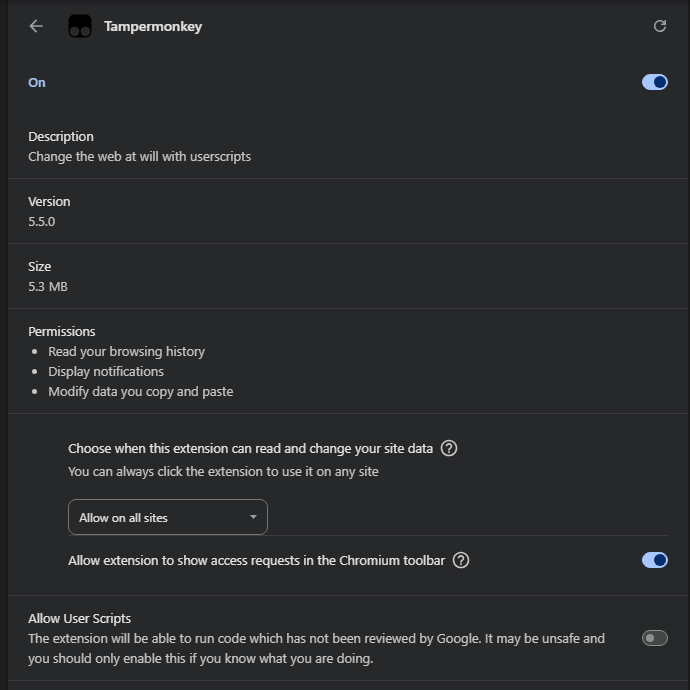
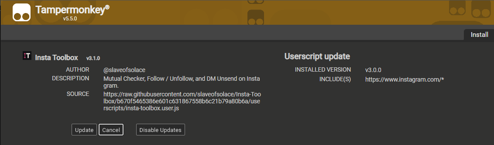
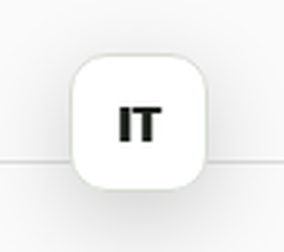

# Install Insta Toolbox 3.1

Tampermonkey is the quickest way to put the toolbox on Instagram. Desktop and web builds provide the larger local workspace for imports, comparisons, reviewed plans, ledgers, and exports.

## Tampermonkey: about one minute

1. Install [Tampermonkey](https://www.tampermonkey.net/).

2. In Chrome, open `chrome://extensions/?id=dhdgffkkebhmkfjojejmpbldmpobfkfo`. Turn on **Allow User Scripts**.

   

3. Open **[Install Insta Toolbox](https://github.com/slaveofsolace/Insta-Toolbox/releases/latest/download/insta-toolbox.user.js)**, then click **Install** in the top-right corner.

   

4. Open or reload [Instagram](https://www.instagram.com/). Click **IT** or press `Alt+Shift+I`.

   

The panel should show **Mutual Checker**, **Follow / Unfollow**, and **DM Unsend**.

### Upgrade from 2.x

Version 3 has a different userscript identity and update channel from 2.x. Remove any 2.x userscript before installing 3.1. Do not keep both enabled: duplicate scripts can create two panels and competing runners.

Export important local data before upgrading. Version 3.0 does not read,
migrate, or delete 2.x browser or desktop state. It starts clean and leaves the
older local data untouched.

### Update

Tampermonkey checks the stable release URL in the script metadata. To update immediately, open the Tampermonkey dashboard, select **Insta Toolbox**, and choose **Check for updates**. You can also reopen the install link above.

### Remove

Open the Tampermonkey dashboard, locate **Insta Toolbox**, and choose **Delete**. Clear storage for `instagram.com` only if you also intend to remove locally saved overlay preferences and data.

## Chrome extension

1. Download `Insta-Toolbox-Extension-3.1.0.zip` from the [latest release](https://github.com/slaveofsolace/Insta-Toolbox/releases/latest).
2. Verify its SHA-256 checksum as described below.
3. Extract the ZIP to a permanent folder.
4. Open `chrome://extensions` and enable **Developer mode**.
5. Select **Load unpacked** and choose the extracted folder.
6. Open or reload Instagram.

Chrome does not load an unpacked extension directly from the ZIP. Keep the extracted folder in place while the extension is installed.

To remove it, open `chrome://extensions`, select **Remove**, and delete the extracted folder if you no longer need it.

## Windows desktop app

1. Download `Insta-Toolbox-Setup-3.1.0.exe` and `SHA256SUMS.txt` from the [latest release](https://github.com/slaveofsolace/Insta-Toolbox/releases/latest).
2. Verify the checksum.
3. Double-click the installer.

The release provides one installer file. The setup wizard lets you choose an
installation directory. It may show a Windows SmartScreen warning because public
builds are unsigned. Check the release checksum and repository source before
choosing **More info** and **Run anyway**.

Uninstall from **Settings > Apps > Installed apps > Insta Toolbox**.

## macOS desktop app

1. Download the recommended `Insta-Toolbox-3.1.0-universal.dmg` and `SHA256SUMS.txt` from the [latest release](https://github.com/slaveofsolace/Insta-Toolbox/releases/latest).
2. Verify the checksum.
3. Open the DMG and drag **Insta Toolbox** to Applications.

The universal package targets Intel and Apple Silicon. Public builds are not notarized unless the release notes explicitly say they are. On first launch, control-click the app, choose **Open**, then confirm the macOS warning.

The release also includes `Insta-Toolbox-3.1.0-universal.zip` as a portable alternative. Verify its checksum, extract it, and move **Insta Toolbox** to Applications. It contains the same universal app and has the same signing and notarization limits as the DMG.

To remove it, quit the app and move **Insta Toolbox** from Applications to Trash. Remove its application data separately only if you want to erase local workspace history.

## Web app and PWA

Open the hosted workspace at:

**[slaveofsolace.github.io/Insta-Toolbox](https://slaveofsolace.github.io/Insta-Toolbox/)**

Use the browser's **Install app** command for a standalone PWA window. Browser wording varies.

To self-host it:

1. Download `insta-toolbox-web-3.1.0.zip` from the [latest release](https://github.com/slaveofsolace/Insta-Toolbox/releases/latest).
2. Verify its checksum.
3. Extract the ZIP.
4. Serve the extracted `insta-toolbox-web` directory over HTTPS or a loopback HTTP origin.

Do not open `index.html` through a `file:` URL. Service workers and PWA installation require a secure or loopback web origin.

To remove an installed PWA, use the browser's app menu. Clear that site's storage if you also want to erase its local data.

## Verify release checksums

Download `SHA256SUMS.txt` from the same release as the package.

### Windows PowerShell

```powershell
Get-FileHash .\Insta-Toolbox-Setup-3.1.0.exe -Algorithm SHA256
Get-FileHash .\Insta-Toolbox-Extension-3.1.0.zip -Algorithm SHA256
```

### macOS or Linux

```sh
shasum -a 256 Insta-Toolbox-3.1.0-universal.dmg
shasum -a 256 insta-toolbox-web-3.1.0.zip
```

The printed hash must match the corresponding line in `SHA256SUMS.txt`. A mismatch means the file should not be opened.

## Build from source

Install Git and Node.js 24, then run:

```sh
git clone https://github.com/slaveofsolace/Insta-Toolbox.git
cd Insta-Toolbox
corepack enable
pnpm install --frozen-lockfile
pnpm run assemble
pnpm test
```

Build outputs are generated from source. Do not edit the generated userscript by hand.

Common package commands:

```sh
pnpm run dist:win
pnpm run dist:mac
pnpm run verify:desktop-archive
pnpm run qa:mac-package
```

## Troubleshooting

### The Instagram panel is missing

- Confirm that only one version 3 script or extension is enabled.
- Confirm that the page URL begins with `https://www.instagram.com/`.
- Reload the tab after installation.
- For Tampermonkey on Chrome, enable **Allow User Scripts**.
- Open the script metadata and confirm that it came from the stable release URL in this guide.

### The desktop app opens with an unsigned-app warning

Verify the SHA-256 checksum first. Follow the Windows or macOS steps above only when the hash matches the release manifest.

### A live action stops

Read the reason shown in the active tool. Challenge, rate-limit, wrong-thread, changed-target, ambiguous-control, and uncertain-result states intentionally stop the run. Reloading does not re-enable a previous action capability.

## Acceptance and support

- [3.1 acceptance record](acceptance/3.1.0.md)
- [3.1 compatibility](compatibility/3.1.0.md)
- [Operator acceptance guide](OPERATOR_ACCEPTANCE.md)
- [Security policy](../SECURITY.md)
- [Open an issue](https://github.com/slaveofsolace/Insta-Toolbox/issues)
